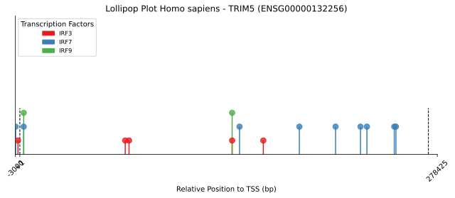
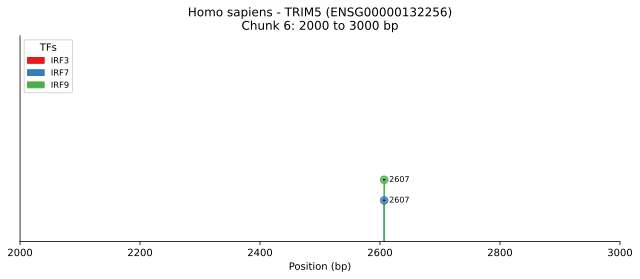

# TFBS-explorer

Explores the presence of transcription factor binding sites (TFBSs) in the promoter regions of human interferon-stimulated genes (ISGs). It identifies and compares motif occurrences of IRF3, IRF7, and IRF9 using JASPAR motif profiles and Biopython-based scanning.

## Table of Contents

- [Clone Repository](#clone-repository)
- [Installation](#installation)
- [Pipeline Module](#pipeline-module)
- [Inputs](#inputs)
- [Outputs](#outputs)
- [Example Command-Line Usage](#example-command-line-usage)
- [Python Libraries Used](#python-libraries-used)
- [Dabatse Used](#databased-used)

## Clone repository
```
git clone https://github.com/Sanghee-L/TFBS-explorer.git
```

## Installation
To perform the analysis, install the required Python libraries:

```bash
pip install requests biopython pyjaspar pandas matplotlib numpy 
```

## Pipeline Module

#### Module 1: Sequence Retrieval
'Fetch_DNA_Sequence.py'
- Fetches upstream, full gene, downstream and transcript- sequences from Ensembl using REST API

#### Module 2: TFBS Scanning
- 'Exact_match.py' - Identifies perfect matches to core motifs
- 'Regex_match.py' - Uses flexible pattern matching
- 'JASPAR_profile.py' - Scans using PSSMs from the JASPAR 2024 database
- 'Elbow_plot.py' - Helps select the optimal threshold for PSSM matching

#### Module 3: Visualisation
- 'Lollipop_plot.py' - Creates lollipop plots of TFBS locations per gene
- 'sub_lollipop_plot.py' - Generates zoomed-in, windowed TFBS plots for detailed inspection


## Inputs

human_IFN_up-regulation.csv : List of 100 genes that are upregulated by IFN (positive control)

human_no_IFN-regulation.csv : List of 100 genes not regulated by IFN (negative control)

#### Input file structure for module 1 (Fetch_DNA_Sequence.py) - positive control

| Species       | Ensembl ID       | Gene       | Expression  | Orthologous Cluster ID |
|----------------|----------------|----------------|----------|-------------|
| Homo sapiens   | ENSG00000157601   | MX1   | up_regulated | HS6198 |
| Homo sapiens   | ENSG00000135114   | OASL   | up_regulated |HS1036 | 

Visit the [Orthologous Clusters of Interferon-Stimulated Genes (ISGs)](https://isg.data.cvr.ac.uk/) database for more information.

## Outputs
Module 1 (CSV file)
- tabular format csv file which contains sequence data (upstream, gene, downstream, transcript)

| Species | gene_Name | ensembl_ID | Upstream | Gene_seq | Downstream | Transcript_ID | 5_UTR | CDS | 3_UTR |
|---------|-----------|------------|----------|----------|------------|---------------|-------|-----|-------|
| Homo sapiens | MFSD10 | ENSG00000109736 | 3kb seq | gene seq | 3kb seq | ENST00000355443 | 5' UTR seq | CDS seq | 3' UTR seq |


Module 2 (CSV file)
- tabular format csv file which contains matches coordinates and metadata

| Species | Gene_Name | ID | Transcription_Factor | Strand | Start | End | Sequence_Type |
|---------|-----------|----|----------------------|--------|-------|-----|---------------|
| Homo sapiens | COL23A1 | ENSG00000050767 | IRF3 | + | 194685 | 194695 | Genomic |
| Homo sapiens | COL23A1 | ENSG00000050767 | IRF9 | + | 194685 | 194695 | Genomic |
| Homo sapiens | STK4 | NSG00000101109 | IRF7 | - | 61826 | 61836 | Genomic |


Module 3 (SVG)

- Lollipop plots to show the TFBS distribution



- Zoomed (windowed) plots for detailed (strand, TFBS position) TFBS distribution and features



## Example Command-Line Usage

#### Module 1 (Fetch_DNA_Sequence.py)
```bash
python3 Fetch_DNA_Sequence.py -i human_IFN_up-regulation.csv -o human_IFN_up_regulation_seq.csv -u 3000 -d 3000
```

| Flag | Description |
|------|-------------|
| -i | Provide input CSV file containing gene list (Ensembl IDs) |
| -o | Assign output CSV file with fetched sequence data |
| -u | Upstream sequence length (in base pairs) |
| -d | Downstream sequence length (in base pairs ) |

#### Module 2 (Scanning)

- Exact_match.py
```bash
python3 Exact_match.py -i ../output/human_IFN_up_regulation_seq.csv -m motif.seq -o pos_exact.csv
```

| Flag | Description |
|------|-------------|
| -i | Provide input CSV file containing gene list (Ensembl IDs) |
| -m | CSV file with exact motif sequences |
| -o | Output CSV file with exact match results |

- Regex_match.py
```bash
python3 Regex_match.py -i ../output/human_IFN_up_regulation_seq.csv -m motif.seq -o pos_regex.csv
```

| Flag | Description |
|------|-------------|
| -i | Input CSV file (from module 1) containing sequence data |
| -m | CSV file with regex motif sequences |
| -o | Output CSV file with regex match results |

- JASPAR_profile.py
```bash
python3 JASPAR_profile.py -i ../output/human_IFN_up_regulation_seq.csv -t IRF3 IRF7 IRF9 -s 14.0 -o pos_jaspar.csv
```

| Flag | Description |
|------|-------------|
| -i | Input CSV file (from module 1) containing sequence data |
| -t | Transcription factor names to scan (e.g., IRF3 IRF7 IRF9) |
| -s | Threshold score for accepting motif matches |
| -o | Output CSV file with JASPAR profile match results |


- Elbow_plot.py
```bash
python3 Elbow_plot.py -t IRF3 -d ./outputs --min_thresh 1.0 --max_thresh 15.0 --pos_exact 20 --pos_regex 150 --neg_exact 5 --neg_regex 90
```

| Flag | Description |
|------|-------------|
| -t | Transcription factor name (for title or labeling) |
| -d | Directory with output files for elbow plot |
| --min_thresh | Minimum threshold score to test |
| --max_thresh | Maximum threshold score to test |
| --pos_exact | Exact match count in positive set |
| --pos_regex | Regex match count in positive set |
| --neg_exact | Exact match count in negative set |
| --neg_regex | Regex match count in negative set |

#### Module 3 (Visualisation)
- Lollipop_plot.py
```bash
python3 Lollipop_plot.py -m pos_jaspar.csv -s human_IFN_up_regulation_seq.csv -d lollipop_plots --upstream 3000 --downstream 3000
```

| Flag | Description |
|------|-------------|
| -m | Input CSV file (from Module 2) with TFBS matches (e.g., from JASPAR_profile.py) |
| -s | Inpuy CSV file with sequence data (from Module 1) |
| -d | Output directory for saving plots |
| --upstream | Length of upstream region used in plotting (e.g., 3,000 bp) |
| --downstream | Length of downstream region used in plotting (e.g., 3,000 bp) |

- sub_lollipop_plot.py
```bash
python3 sub_lollipop_plot.py -m pos_jaspar.csv -s human_IFN_up_regulation_seq.csv -d sub_lollipop_plot -g TRIM5 -c 1000
```

| Flag | Description |
|------|-------------|
| -m | Input CSV file (from Module 2) with TFBS matches (e.g., from JASPAR_profile.py) |
| -s | Inpuy CSV file with sequence data (from Module 1) |
| -d | Output directory for saving zoomed plots |
| -g | Gene name to plot (e.g., TRIM5) |
| -c | Chunk size in base pairs for sub_lollipop plots (e.g., 1,000) |

## Python Libraries Used

| Library             | Description                                       | Version   | Link                                                                 |
|---------------------|---------------------------------------------------|-----------|----------------------------------------------------------------------|
| `requests`          | HTTP requests to APIs (used to query Ensembl)     | 2.32.3    | [docs.python-requests.org](https://docs.python-requests.org)        |
| `argparse`          | Handles command-line arguments                    | Built-in  | [argparse](https://docs.python.org/3/library/argparse.html)         |
| `pandas`            | DataFrame and data handling                       | 2.3.0     | [pandas.pydata.org](https://pandas.pydata.org)                      |
| `re`                | Regex operations                                  | Built-in  | [re module](https://docs.python.org/3/library/re.html)              |
| `Bio` (Biopython)   | Sequence manipulation (e.g., reverse complement)  | 1.85      | [biopython.org](https://biopython.org)                              |
| `pyjaspar`          | JASPAR motif access                               | 3.0.0     | [pyjaspar GitHub](https://github.com/asntech/pyjaspar)              |
| `matplotlib.pyplot` | Data visualisation                                | 3.9.4     | [matplotlib.org](https://matplotlib.org)                            |
| `matplotlib.patches`| Drawing elements (e.g., legends)                  | 3.9.4     | [matplotlib.org](https://matplotlib.org)                            |
| `numpy`             | Array computation and numeric support             | 2.0.2     | [numpy.org](https://numpy.org)                                      |
| `os`                | OS-level file handling                            | Built-in  | [os module](https://docs.python.org/3/library/os.html)              |


## Databased Used

| Database | Description | Link | Citation |
|----------|-------------|------|----------|
| Ensembl | Ensembl provides genome annotation, gene models, and regulatory data across many species. TFBS-explorer used the Ensembl REST API to retrieve genomic sequences, including upstream, downstream, and transcript data | [Ensembl web Link](ensembl.org) | Yates et al. (2020) doi:10.1093/nar/gkz966 |
| JASPAR 2024 | JASPAR is an opne-access database of transcription factor binding profiles, represented as position-specific scoring matrices (PSSMs). | [JASPAR web link](jaspar.genereg.net) | Khan et al. (2024) doi:10.1093/nar/gkad978 |
| Orthologous Clusters of ISGs | Public dataset categorising genes based on IFN responsiveness (upregulated, downregulated, or non-regulated) using transcriptomic data acorss species. Used to define positive and negative control gene sets | [isg.data.cvr.ac.uk] | Shaw et al. (2017) doi:10.1016/j.cub.2017.08.031 |